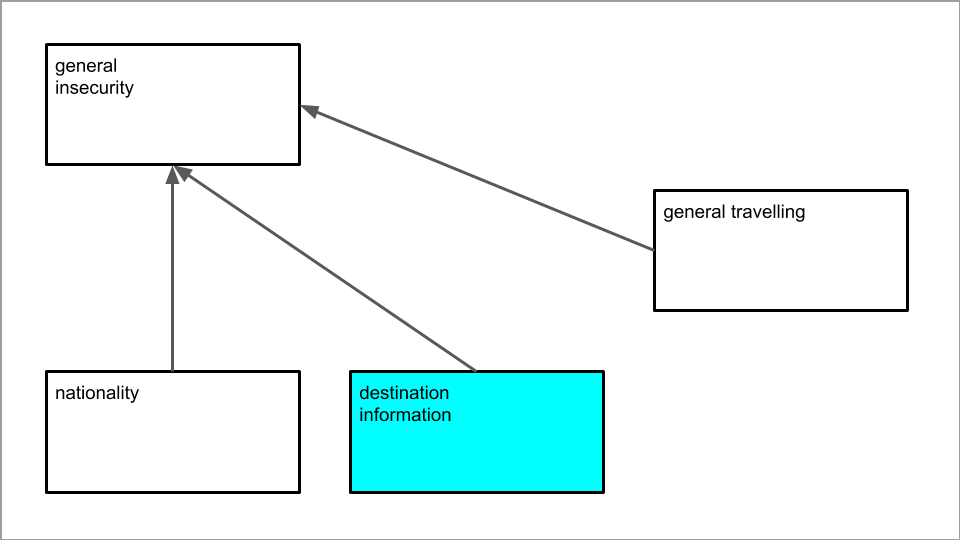

# Förarbete {#chap06}
[06-0-wc-file]: <> (98.21 %)
[06-0-comment]: <> (2 sidor)

Innan man genomför ett experiment är det viktigt att noga undersöka om liknande experiment redan genomförts genom tidigare forskning. Inom samhällsvetenskapliga ämnen kan det exempelvis vara intressant att undersöka hur mediepublikers attityder, kunskaper och beteenden påverkas av olika typer av kommunikativa åtgärder (interventioner), t.ex. en marknadsföringskampanj eller ett politiskt budskap. På samma sätt är det inom medicinska vetenskaper ofta av intresse att utröna om ett nytt läkemedel har någon positiv effekt på patienter jämfört med en kur bestående av verkningslösa sockerpiller. Ju mer mån man är att undersöka ett tillförlitligt kausalt samband mellan en behandling och tillståndet hos målgrupp, desto viktigare blir det att kunna genomföra ett kontrollerat experiment, där effekterna av en behandling systematiskt jämförs med effekterna av en annan behandling (eller ingen behandling alls). 

Det är inte ovanligt att en organisation som investerar pengar i en marknadsföringskampanj, också vill utvärdera olika kausala effekter av denna kommunikation på konsumenter. Genom att inventera tidigare forskningslitteratur inom detta specifika område, visar det sig ofta vilka mått och mätmetoder som använts, samt vad man kan förvänta sig om man genomför ett nytt experiment inom ett liknande experimentellt paradigm (REF). Framför allt kan tidigare forskning hjälpa oss att formulera några övergripande _forskningsfrågor_ som på något sätt för forskningsfältet framåt. Alla dessa aspekter av hur en ny, planerad studie förhåller sig till tidigare forskning, är viktiga genom hela forskningsprocessen. Tidigare använda mått och mätmetoder kan nämligen ge en god uppfattning om hur vi ska _operationalisera_ våra forskningsfrågor till mätbara variabler (mer om detta längre fram). Tidigare uppnådda resultat, å andra sidan, genererar vissa förväntningar om vilka resultat vårt eget experiment kommer att leda till, vilket i sin tur hjälper oss att formulera motiverade _hypoteser_ som är härledda från tidigare forskning inom området [@holmberg-2016-effects].

Inom flera samhällsvetenskapliga discipliner har den konstruktivistiska kunskapssynen haft en framträdande roll under de senaste decennierna (ref). Som en konsekvens av detta har det blivit viktigt att ange en så kallad teoretisk referensram i samband med att man introducerar en kvalitativ forskningsstudie. Denna samling av teoretiska perspektiv (t.ex. retorisk eller semiotisk teoribildning) har sedan en viktig funktion vid analysen av empiriskt material, närmare bestämt genom att materialet tolkas med utgångspunkt i de teoretiska perspektiv man valt (därav den så kallade hermeneutiska forskningstraditionen). Inom den experimentella forskningen beskrivs kunskapssynen snarare som positivistisk, och teoretiska perspektiv används för att göra förutsägelser eller prediktioner om numeriska samband vi förväntar oss att hitta i kvantitiva mätdata. Detta gör att teorier generellt sett spelar en annan roll inom ett experiment jämfört med en kvalitativ studie, eftersom experiment använder empiriska resultat för att testa, och eventuellt uppdatera, befintlig teoribildning. Se även vetenskapsteori, Del 1.

När vi rapporterar förarbetet till ett experiment, görs detta ofta inom artikelns introduktion (jfr. akronymen IMRD i kapitel 8). När man introducerar en experimentell studie brukar man inleda med en kort bakgrund av det aktuella forskningsläget och en motivering till den genomförda undersökningen. Det är viktigt att det i ett tidigt skede står klart för läsaren vilket forskningsproblem (eller \"kunskapsgap\") studien vill bidra till att undersöka och helst råda bot på. Genomgången av tidigare forskning ska leda fram till och motivera den aktuella studiens forskningsfrågor och hypoteser. Det blir därmed viktigt att introduktionen och forskningsfrågorna refererar till empiriska resultat från tidigare forskning.

## Forskningsfrågor {#sec06.1}
[06-1-wc-file]: <> (83.80 %)
[06-1-comment]: <> (3 sidor)

En viktig del av introduktionen till alla typer av vetenskapliga studier är att presentera studiens forskningsfrågor. Forskningsfrågor brukar i allmänhet vara nära kopplade till studiens syfte och mål, och bör därför vara möjliga att besvara inom ramen för studiens genomförande. 

En forskningsfråga ska på ett någorlunda enkelt och kortfattat sätt sammanfatta vilka frågeställningar som ett specifikt experiment adresserar. Därför är det förhållandevis accepterat att forskningsfrågor är något abstrakt formulerade, så länge de ändå är enkla, lättfattliga och kortfattade. Introduktionens vidare uppgift är nämligen att konkretisera studiens forskningsfrågor genom en process som kallas _operationalisering_, i vilken dessa forskningsfrågor omsätts till mätbara variabler som sedan kan ingå i falsifierbara _hypoteser_. Man kan därför uttrycka det som att hypoteserna i en experimentell studie operationaliserar studiens forskningsfrågor. Operationalisering är ett mycket viktigt begrepp inom experimentell forskning, och vi återkommer mer utförligt till detta begrepp lite längre fram i detta kapitel, där vi också diskuterar hur detta begrepp hänger ihop med hypotesformulering.

```{r test-tab, tidy=F, echo=FALSE}
knitr::kable(
  data.frame(col_a=c("a","b","c"), col_b=c(1,2,3), col_c=c(45:47)),
  caption = 'This is a test table.',
  booktabs=TRUE
)
```

Återgår vi till att diskutera begreppet forskningsfrågor mer generellt så finns det vissa tumregler som är viktiga att beakta. Den första tumregeln är att en forskningsfråga i någon del bör bygga på tidigare forskningsresultat, samt i någon del bör innehålla något nytt och outforskat. Med en sådan forskningsfråga kan man både upprepa (replikera) aspekter av tidigare forskning, men också utöka (extendera) tidigare forskning i syfte att skapa ny kunskap. En annan regel är att en forskningsfråga naturligtvis inte ska innehålla flera olika frågor, samt att två forskningsfrågor inte bör vara beroende av varandra (se övrig metodlitteratur, ref). Inom ramen för denna lärobok antar vi att en intressant forskningsfråga handlar om hur bildinnehållet i Facebook-poster påverkar läsarnas beteende och attityder. Närmare bestämt vill vi undersöka en upptäckt inom psykologisk forskning som visar att ett budskap upplevs som mer övertygande om det görs av en person som uppfattas som en auktoritet inom ett område (REF: Cialdini, 2001). Exempelvis kan vi föreslå att personen Leif GW Persson uppfattas som en auktoritet inom området kriminologi bland stora delar av den svenska mediepubliken. Vidare tänker vi oss att budskapet i en Facebook-post kan associeras med en auktoritetsperson genom att denna person visas i en bild som tillhör posten.

### Planering av forskningsfrågor {#sub06.1.1}

I vårt tänkta experiment kretsar forskningsfrågorna kring effekterna av bildegenskaper hos Facebook-poster på internetanvändares visuella uppmärksamhet i samband med att de interagerar med dessa poster, samt effekter av bildinnehåll på användarnas självrapporterade nivå av upplevd trovärdighet hos samma poster. Låt oss anta att tidigare forskning ger vid handen att självskattad (eller upplevd) trovärdighet i nyhetsartiklar oftast har uppmätts med hjälp av enkätfrågor där försöksdeltagaren får besvara frågor av typen \"Hur trovärdig var den nyhetsartikel du nyss läste?\", genom att välja ett svarsalternativ på en 7-gradig skala, där värdet 1 innebär \"Inte alls trovärdig\", värdet 4 innebär \"Varken trovärdig eller inte\", samt värdet 7 betyder \"Mycket trovärdig\". Tidigare ögonrörelseforskning visar att pupillens position på en datorskärm är en bra indikator på vilka objekt på en webbsida som användaren riktar sin visuella uppmärksamhet mot. Detta samband är mycket användbart i föreliggande experiment, och kommer att diskuteras mer ingående nedan. Forskningsfrågor bör vara ganska generellt formulerade, vilket gör att de ofta kan ha ett nära samband med studiens målsättningar.

### Rapportering av forskningsfrågor {#sub06.1.2}

När man arbetar med ett manuskript för en artikel eller uppsats så formuleras ofta forskningsfrågorna som \"research questions\", vilket ibland förkortas RQ. En studie kan naturligtvis fokusera på flera relaterade forskningsfrågor, men det vanligaste är att man adresserar en eller två huvudfrågor, som sedan kan delas in ytterligare i underfrågor (RQ1a, osv). Vissa vetenskapliga tidskrifter har en mycket strikt tolkning av experimentell metod, vilket innebär att hypoteserna i ett så kallat naturligt experiment bara kan kallas forskningsfrågor. Exempel på formulerade forskningsfrågor med anknytning till bokens exempel-experiment. Således, i vårt tänkta experiment skulle den första forskningsfrågan kunna formuleras:

- RQ1: Hur påverkar bildinnehållet i sociala medier-poster användarnas beteenden och attityder?

Som underfrågor till denna forskningsfråga skulle man kunna tänka sig \"RQ1a: Hur påverkar bildinnehållet i Facebook-poster läsarnas blickbeteende\", och \"RQ1b: Hur påverkar bildinnehållet i Facebook-poster läsarnas attityder gällande postens trovärdighet\".


## Operationalisering {#sec06.2}
[06-2-wc-file]: <> (135.59 %)
[06-2-comment]: <> (3 sidor)

En annan mycket viktig del av förarbetet till ett experiment är att fundera på hur abstrakta begrepp inom forskningsfrågorna kan konkretiseras och omsätts till mätbara variabler. Denna process brukar kallas för **operationalisering**. För att utveckla detta resonemang kan det vara användbart med ett exempel. En samhällsvetenskaplig studie vill undersöka hur befolkningens attityder till miljövänlig sophantering har förändrats under senare år. Denna forskningsfråga innehåller som synes ett antal abstrakta begrepp (bl.a. \"befolkning\", \"attityder\", \"miljövänlig\" och \"förändring\") som behöver definieras och operationaliseras för att kunna studeras praktiskt. Ett sätt att operationalisera begreppet \"attityder\" i detta sammanhang vore kanske att intervjua ett antal personer om vad de tycker om miljövänlig sophantering. Detta kan potentiellt ge ett rikt och intressant empiriskt material i form av intervjusvar, men risken är att olika individer uppfattar denna fråga på olika sätt, vilket gör det svårt för forskarna att sammanställa resultaten av intervjun.

För att minska risken för subjektiva feltolkningar och förenkla sammanställningen av resultaten skulle forskarna kunna operationalisera begreppet \"attityd\" ytterligare genom att formulera påståenden av typen \"det är viktigt att sophanteringen är miljövänlig\", och därefter låter deltagaren svara på en 7-gradig skala, där värdet 1 betyder att man tar helt avstånd från påståendet, medan värdet 7 betyder att man helt instämmer. I detta fall omsätts attityd-begreppet till en variabel som kan anta värdena 1-7 (samt eventuellt värdet 0 om man väljer att inte svara). Standardisering, reliabilitet. Man kan också tänka sig att man försöker operationalisera attityder ytterligare genom att mäta kortisolnivåer i blodet. Kanske tänker man sig att starka attityder tar sig uttryck i en ökning av detta stresshormon? Även om detta skulle kunna genomföras som mycket objektiva och väldefinierade mätningar, så finns det förmodligen lite forskning som styrker ett samband mellan attityd och kortisolnivå, vilket gör detta till ett exempel på en dålig operationalisering som skulle resultera i en forskningsstudie med låg validitet eller giltighet.

I exemplet ovan har vi diskuterat olika operationaliseringar av medborgares attityder till en samhällsfråga. Den lägsta graden av operationalisering var att fråga ett antal undersökningsdeltagare vad de tycker i frågan och spela in intervjusvaren. Denna metod kräver omfattande efterbearbetning och kategorisering av materialet, och observationerna kommer att präglas av låg reliabilitet, då deltagares subjektiva tolkningar av attityd gör att svaren varierar på ett oförutsägbart sätt. En högre grad av operationalisering kan åstadkommas genom att istället låta deltagarna uttrycka sina attityder genom att ta ställning till hur lite eller mycket de instämmer i påståenden på en 7-gradig ordinalskala. Denna metod kräver mindre efterbearbetning för att sammanställa svaren, och eftersom både enkätfrågor och svarsalternativ presenteras i ett standardiserat format så ökar också reliabiliteten. Om vi analyserar tidigare forskning om attityder kommer vi också upptäcka att detta är ett beprövat sätt att operationalisera och undersöka just attityder, vilket indikerar att detta är en lämplig metod. Den högsta graden av operationalisering skulle kunna vara att mäta kortisolnivåer i blodet som en indikator på deltagarnas attityder. Även om detta skulle kunna ge oss mycket exakta, kontinuerliga, och tillförlitliga data på grund av att mätningarna är objektiva snarare än självrapporterade, så är detta ändå en olämplig metod eftersom den har en låg validitet eller giltighet i förhållande till fenomenet attityder.

Vad denna diskussion vill komma till är att operationalisering i grunden handlar om att omsätta ett kvalitativt begrepp till en kvantitativ mätvariabel, och detta är ett viktigt och nödvändigt moment i alla experimentella studier. Det finns ofta många sätt att operationalisera ett begrepp till en mätvariabel, men genom att konsultera tidigare forskning så får vi en fingervisning om mer och mindre lämpliga sätt att operationalisera. Begreppet operationalisering har också en koppling till distinktionen mellan olika datatyper och den varierande mängden information dessa datatyper anses innehålla. Lägre grad av operationalisering hänger då samman med mindre informationsmängd, t.ex. en kategorisk variabel (även kallat nominaldata). En datatyp med mer information och därmed högre operationalisering är ordinalskalor (eller likertskalor). Den högsta graden av operationalisering hänger samman med den mest informationsrika typen av data, eller kontinuerliga data (REF).

Från forskningsfråga till variabler. Våra forskningsfrågor handlar om hur egenskaper (s.k. faktorer) hos Facebook-poster påverkar läsares uppmärksamhet och upplevda trovärdighet. Baserat på tidigare psykologisk forskning tänker vi oss att bilder som innehåller auktoritetspersoner kan öka mängden visuell uppmärksamhet (beteende) på en Facebook-post samt öka upplevd trovärdighet (attityd) hos samma post. Givet detta sammanhang så blir mängden visuell uppmärksamhet, uppmätt som antal sekunder läsare tittar på Facebook-poster, vår första mätvariabel. Vidare blir upplevd trovärdighet, uppmätt på en skala från 1 (låg trovärdighet) till 7 (hög trovärdighet), vår andra mätvariabel. Dessa blir två mätvariabler kallas också för våra beroende variabler (mer om variabler i kapitel 7).

### Planering av operationalisering {#sub06.2.1}

När vi väl etablerat vilka variabler som är våra beroende variabler, kan vi också definiera vilka variabler vi kommer använda för att förklara systematiska skillnader i mätvariablerna. Dessa kallar vi våra förklaringsvariabler, eller oberoende variabler. I vårt tänkta experiment kommer den viktigaste förklaringsvariabeln att utgöras av bildinnehållet i Facebook-poster, där innehållet kan variera mellan \"auktoritetsperson\" och \"neutral person\". Eftersom denna variation av bildinnehåll i grunden är en kvalitativ skillnad som inte på ett meningsfullt sätt kan kvantifieras, innebär det att förklaringsvariabeln är kategorisk snarare än en ordinalskala (som vi använder för att mäta deltagarnas attityder) eller en kontinuerlig skala (som används för att mäta hur länge deltagarna tittar på Facebook-posterna). I detta experiment förväntar vi oss alltså att variabeln \"bildinnehåll\" kommer att ha en kausal effekt på läsarnas blickbeteende och upplevelse av trovärdighet. En viktig del av operationalisering är att argumentera för att omsättningen av studiens begrepp till mätvariabler är giltig, dvs. präglas av validitet. Andra variabler som kan tänkas inverka på mätvariablerna i detta experiment är t.ex. demografiska variabler såsom ålder och kön hos deltagarna. Eftersom dessa variabler dock inte är centrala för vår frågeställning, kommer vi inte referera till dessa som oberoende variabler, utan som kontrollvariabler.

### Rapportering av operationalisering {#sub06.2.2}

I vårt tänkta experiment kretsar forskningsfrågorna kring effekterna av bildegenskaper hos Facebook-poster på internetanvändares visuella uppmärksamhet i samband med att de interagerar med dessa poster, samt effekter av bildinnehåll på användarnas självrapporterade nivå av upplevd trovärdighet hos samma poster. Tidigare forskning ger vid handen att självskattad (eller upplevd) trovärdighet i nyhetsartiklar oftast har uppmätts med hjälp av enkätfrågor där försöksdeltagaren får besvara frågor av typen \"Hur trovärdig var den nyhetsartikel du nyss läste?\", genom att välja ett svarsalternativ på en 7-gradig skala, där värdet 1 innebär \"Inte alls trovärdig\", värdet 4 innebär \"Varken trovärdig eller inte\", samt värdet 7 betyder \"Mycket trovärdig\". Tidigare ögonrörelseforskning visar att pupillens position på en datorskärm är en bra indikator på vilka objekt på en webbsida som användaren riktar sin visuella uppmärksamhet mot. Därför är uppmätning av pupillposition på datorskärmen en lämplig operationalisering av visuell uppmärksamhet. Detta samband är mycket användbart i föreliggande experiment. Operationaliseringen av forskningsfrågorna rapporteras vanligen i introduktionen till en forskningsartikel.

## Hypotestestning {#sec06.3}
[06-3-wc-file]: <> (107.73 %)
[06-3-comment]: <> (3 sidor)

Introduktionen av en forskningsartikel börjar alltså med att behandla studiens forskningsfrågor, dess centrala begrepp samt hur man gått tillväga för att operationalisera dessa begrepp i form av mätbara variabler. Efter att dessa aspekter har diskuterats är det lämpligt att introduktionen mynnar ut i studiens hypoteser. Den exakta formuleringen av dessa hypoteser är ofta ett av de mer krävande momenten i att genomföra en experimentell studie, eftersom hypoteserna löper som en röd tråd genom hela studien. Även om idealet är att hypoteserna ska formuleras tidigt i forskningsprocessen (studiens förarbete) och sedan inte förändras, så sker i praktiken ofta mindre justeringar av hypoteserna för att bättre anpassa dem till det faktiska genomförandet av studien.

Relationen mellan forskningsfrågor och hypoteser består i att om de förstnämnda uttrycks som generella frågor, så uttrycks hypoteser snarare som specifika och konkreta påståenden eller antaganden. Återgår vi till den forskningsfråga vi formulerade som exempel i denna lärobok, så löd den som följer: \"RQ1: Hur påverkar bildinnehållet i Facebook-poster människors beteenden och attityder i relation till dessa poster?\" Efter att vi formulerat denna forskningsfråga gick vi vidare till det moment vi kallar operationalisering, i vilket vi omsätter forskningsfrågan till mätbara variabler. I vårt fall utgick vi från tidigare forskning som visade att ögonrörelsemätning ofta använts för att objektivt observera och mäta människors visuella beteende i samband med att man läser texter på nätet. Vidare upptäckte vår forskningsgenomgång att människors attityder ofta undersökts genom självrapportering med hjälp av så kallade likert-skalor. I det sista steget använder vi de variabler som framkom i operationaliseringen till att formulera hypoteser. Närmare bestämt formuleras hypoteserna som förväntade relationer mellan förklaringsvariabeln \"bildinnehåll\" (dvs. auktoritetsperson eller neutral person) och mätvariablerna \"visuell uppmärksamhet\" och \"upplevd trovärdighet\". Sammanfattningsvis måste alltså hypoteserna vara underbyggda av tidigare forskning, och förväntade resultat måste motiveras utifrån tidigare erhållna forskningsresultat.

Det är inte ovanligt att en experimentell studie antar att det finns flera mätvariabler som påverkar en beroende variabl. I vårt exempel-experiment skulle vi till exempel kunna samla in mätdata om försöksdeltagarnas internetvanor och deras demografiska egenskaper, och undersöka hur dessa egenskaper bidrar till att förklara skillnader i exempelvis mängden visuell uppmärksamhet deltagarna spenderar på att titta på Facebook-posterna. I så fall antas hypoteserna gälla under en modell som inkluderar alla variabler. Detta kan visualiseras grafiskt med en modell.

```{r img-model, echo=F, fig.cap="en teoretisk modell", out.width='80%', fig.asp=.75, fig.align='center'}

```

### Planering av hypoteser {#sub06.3.1}

Inom flera samhällsvetenskapliga ämnen använder man sig av ett ramverk som kallas \"Null Hypothesis Significance Testing\" (förkortat NHST) i samband med att man formulerar hypoteser inom ett experiment (REF). Detta ramverk säger i princip att varje hypotes ska uttrycka endast _ett_ förväntat samband mellan studiens variabler. Hypoteserna ska vara formulerade så att _riktningen_ på förväntade samband framgår. I vårt experiment förväntar vi oss till exempel att när bildinnehållet varieras från \"neutral person\" till \"auktoritetsperson\" så kommer visuell uppmärksamhet och upplevd trovärdighet att öka. Vidare ska hypoteserna formuleras så att de går att falsifiera. Noll-hypotesen (H0) är att det inte finns någon statistiskt mätbar (signifikant) skillnad mellan villkoren. Om vi uppmäter en signifikant skillnad i våra beroende variabler mellan villkoren så förkastar vi noll-hypotesen. Det är mycket svårare att bevisa att ingen skillnad finns mellan två villkor, än att bevisa att en skillnad uppmätts (det förra alternativet kräver andra statistiska metoder som ibland kallas för Bayesianska).

### Rapportering av hypoteser {#sub06.3.2}

Rapportering av hypoteser brukar komma i slutet av introduktionen, före rapportering av metoder. Till skillnad från generella forskningsfrågor, försöker vi formulera dessa hypoteser som specifika antaganden gällande samband mellan variabler. Styrkan med en experimentell studie är att vi kan formulera hypoteserna som kausala orsakssamband. När vi först manipulerar en oberoende förklaringsvariabel såsom \"bildinnehåll\" antar vi alltså att denna variation sedan _orsakar_ skillnader i de beroende variabler vi använder för att mäta försöksdeltagarna beteende och attityder. Inom vissa delar av den psykologiska forskningen kallas denna relation för stimulus-respons. Vi kan prata om kausala samband så länge det är ett kontrollerat experiment. Svårare om det är ett naturligt experiment. Slutligen ska riktningen på förväntade samband framgå. När vi tagit hänsyn till dessa kan vi sedan formulera en hypotes per beroende variabel som ingår i vår undersökning:

- H1: Facebook-poster med bild på en auktoritetsperson kommer att orsaka mer visuell uppmärksamhet på posten jämfört med bilder som innehåller en neutral person.

- H2: Facebook-poster med bild på en auktoritetsperson kommer att orsaka högre upplevd trovärdighet hos posten jämfört med bilder som innehåller en neutral person.

Enligt NHST-modellen föregås dessa hypoteser egentligen av en så kallad noll-hypotes, under vilken vi antar att skillnader i bildinnehåll hos Facebook-poster **inte** kommer att orsaka några skillnader, varken vad gäller visuell uppmärksamhet eller upplevd trovärdighet. Noll-hypotesen brukar inte explicit skrivas ut då den är underförstådd, men den hade kunnat formuleras ungefär som: \"H0: Facebook-poster med bild på en auktoritetsperson kommer inte att ha någon effekt på visuell uppmärksamhet (eller upplevd trovärdighet) gentemot posten jämfört med bilder som innehåller en neutral person\". Detta innebär att om vår studie inte finner stöd för t.ex. den första hypotesen (H1) så är den falsifierad, och vi kan därmed antar att resultaten stödjer motsvarande noll-hypotes (H0).

The hypothetico-deductive model or method (step 1-4) this method can never absolutely verify (prove the truth of) 2. It can only falsify 2. This is what Einstein meant when he said, "No amount of experimentation can ever prove me right; a single experiment can prove me wrong." [@einstein2002induction]


## Pre-registration {#sec06.4}
[06-4-wc-file]: <> (17.14 %)
[06-4-comment]: <> (1 sidor)

TODO: Vad heter pre-registration på svenska? Kanske förregistrering. Koppling till open science framework: making research data and methods FAIR (findable, accessible, interoperable and reusable) and results reproducible. Här kommer en referens [@van2016pre] till denna relativt nya företeelse.


