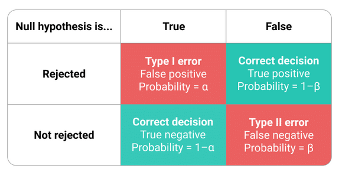

# Efterarbete {#chap08}
[08-0-wc-file]: <> (104.82 %)
[08-0-comment]: <> (2 sidor)

Vi närmar oss nu slutet av bokens andra del, som handlar om de konkreta aspekterna av planering och genomförande av samhällsvetenskapliga experiment. Eftersom dispositionen av Del 2 också i viss utsträckning försöker följa den typiska kronologin i ett experiment, innebär det att vi nu får tänka oss att vi planerat och genomfört experimentet i alla dess delar, och slutligen samlat in all den data som kommer användas när vi rapporterar experimentets resultat. Vi skulle kunna kalla detta skede för experimentets _efterarbete_, eftersom vi nu inte räknar med att kunna gå tillbaka och ändra något i de tidigare stegen, och att vi inte heller egentligen kommer kunna tillföra mer data till den slutgiltiga resultatrapporteringen. Eftersom denna sista fas i experimentet ingalunda kan anses trivial att genomföra, tycker vi att det kan vara berättigat att inkludera dessa avslutande kapitel. (Nyss lästa mening överenstämmer inte riktigt med verklighten, för i realiteten kommer de flesta som använder experimentell metod att behöva gå tillbaka och ändra saker, men genom att upprepade gånger träna på att genomföra experiment kan vi småningom närma oss idealet att göra rätt från början.) 

Ett annat sätt att förstå denna Del 2 av boken är att relatera till dispositionen i en vetenskaplig artikel. Sådana artiklar använder ofta en struktur, som börjar med en introduktion av tidigare forskning och motivering av hypoteser (förarbete), och som därefter avhandlar studiens konkreta implementation och datainsamling (genomförande), och som avslutningvis rapporterar och diskuterar studiens resultat (efterarbete). Just denna s.k. IMRD-disposition kommer vi för övrigt titta närmare på lite längre fram i kapitlet om publicering, men i nästa kapitel kommer vi fokusera på hur vi som forskare brukar rapportera _resultat_ från ett experiment. Denna resultatrapportering är ett av de viktigaste momenten i efterarbetet, och kräver att varje delresultat härleds från de hypoteser som utvecklades i förarbetet. Minst lika viktigt som själva resultaten, är att sedan göra en avslutande _diskussion_ av dessa resultat, där forskaren väger in andra orsaker till de resultat som faktiskt observerats. När dessa avslutande delar är på plats, kan det slutligen bli aktuellt med _publicering_, vilket innebär processen att gå från ett textmanuskript till en färdig och sakkunniggranskad artikel i en vetenskaplig tidskrift.

Resultat och diskussion handlar i mångt och mycket om att sammanfatta och summera allt det arbete som legat till grund för experimentet, samt att sammanställa den empiriska data som det genererat. På samma vis kommer de nästkommande kapitlen i någon mån sammanfattas alla tidigare kapitel i Del 2, samt gå tillbaka till början. En viktig princip i det praktiska arbetet med ett experiment är dock att inte enbart jobba framåt kronologiskt, utan att också i någon mening arbeta sig bakåt från diskussion och resultat, tillbaka till metoder, planering, och introduktion. Vad menas då med detta? Jo, att det faktiskt kan hjälpa att visualisera slutprodukten, dvs. en publicerad artikel, och därifrån resonera om hur vi bäst borde presentera våra resultat och diskussion. Utifrån denna modell av planerade resultat kan vi resonera oss vidare till hur våra data kan analyseras, vilka mätinstrument som kan bli aktuella, samt vilka villkor våra deltagare kan komma att ingå i. Därifrån kommer vi slutligen till introduktionen med dess hypoteser och tidigare forskning. Uttryckt något annorlunda, vill detta resonemang understryka vikten av att hitta ett modell-experiment som kan hjälpa oss att planera och utforma vårt eget experiment.

Denna text kommer är tänkt att ersätta sektion 08 resultat och 09 diskussion. Därmed frångår boken den tidigare indelningen enligt IMRD. Domstolsmetafor, slutplädering. Titta i backspegeln metafor.


## Resultat {#sec08.1}
[08-1-wc-file]: <> (118.42 %)
[08-1-comment]: <> (5 sidor)

När vi inleder experimentets efterarbete räknar vi inte med att kunna gå tillbaka och ändra något i de tidigare stegen, och vi räknar egentligen inte heller med att kunna tillföra mer data till våra beräkningar. Resultatrapporteringen som nu tar vid är ett av de viktigaste momenten i efterarbetet, och kräver att varje delresultat härleds från de hypoteser som utvecklades i förarbetet. Det brukar inte betraktas som god forskningssed (på engelska "good research practice") att göra det omvända och anpassa hypoteserna till resultaten (jfr. "scientific misconduct"), även om detta ibland förekommer i praktiken (REF VR). 

Anledningen till att vilja ändra hypoteserna i efterhand kan vara att experimentet inte påvisat de resulat som förväntades, vilket ibland uppfattas som att studien blir mindre intressant att publicera. Här vill vi dock hävda att s.k. noll-resultat (t.ex. icke-signifikanta effekter) eller oförväntade resultat (t.ex. signifikant effekt i motsatt rikning) också kan vara viktiga förutsatt att experimentents förarbete och genomförande är korrekt. 

Ibland pratar man även om konfirmatoriska eller replikerande resultat (engelska "confirmatory") i motsats till explorativa (engelska "exploratory"), där den senare typen av resultat ibland anses vara mer publicerbara på grund av de har ett högre nyhetsvärde. Som vi har försökt argumentera i denna bok, kan det vara bra att designa ett experiment så att det innehåller lite av varje. Oavsett dessa distinktioner, är det dock generellt sett viktigt att redovisa resultaten i ett standardiserat format som på effektivt sätt sammanställer experimentet i dess helhet. Detta innebär att resultaten bör vara nära kopplade till hypoteserna, och att texten formuleras kortfattat på ett koncist och lättfattligt språk. 

Med detta sagt, ska vi samtidigt vara medvetna om att just resultatdelen kanske är den del av en artikel som kan upplevas som mest komplicerad, bland annat eftersom den tenderar att innehålla mycket siffror och statistisk jargong. Som forskare handlar det alltså ofta om att hitta avvägningar mellan en tillräckligt exakt och detaljerad resultattext, som samtidigt är tillräckligt kortfattad och begriplig. Här vill vi passa på att understryka att denna bok fokuserar på experimentell metod, och därmed inte kommer utveckla några resonemang kring statistiska metoder, även om dessa områden i praktiken är nära sammankopplade. Här hänvisar vi läsaren till befintlig litteratur inom statistiska metoder (REF).

### Beskrivande resultat {#sub08.1.1}

För att få en översiktlig uppfattning om de viktigaste variablerna i ett experiment, kan resultatanalysen ibland inledas med beskrivande resultat eller deskriptiv statistik. Om vi har genomfört ett experiment där en beroende variabel är hur mycket visuell uppmärksamhet deltagare ägnat åt Facebook-poster så kan det vara intressant, både för oss själva som forskare såväl som för utomstående läsare, att få en uppfattning om vad som var den genomsnittliga tiden som försöksdeltagarna tittade på en sådan Facebook-post (s.k. centraltendens), samt hur pass mycket dessa observationer var spridda runt medelvärdet (s.k. spridningsmått). 

För att rapportera detta skulle vi kunna sammanställa medelvärdet av fixeringstiden (vårt mått på visuell uppmärksamhet) på alla Facebook-poster som ingått i studien (låt oss säga 10.5 sekunder), dessutom skulle vi kunna beräkna standardavvikelsen för denna variabel (t.ex. 2.3 sekunder). Därefter skulle vi kunna göra samma sak för eventuella andra beroende variabler i undersökning, i vårt fall använde vi oss också av en 7-gradig skala som mätte deltagarnas självrapporterade upplevelse av trovärdighet för varje Facebook-post. Vi skulle kunna upprepa denna procedur med alla kvantitativa variabler vi använt i studien, och därefter presentera dessa beskrivande resultat i en tabell, och kanske även med hjälp av diagram. 

```{r tab-02-08-1-1, echo=F}
knitr::kable(read.table("../csv/tab-02-08-1-1.csv", header=T, sep='\t', quot='"', stringsAsFactors=F, comment.char=""), format="pipe", digits=3, caption='Beskrivande resultat eller deskriptiv statistik.', booktabs=TRUE)
```

Vi kan ta denna beskrivande statistik och representera resultaten grafiskt i ett stapeldiagram. På den lodräta y-axeln är det i så fall brukligt att placera den beroende variabeln (eller mätvariabeln, eller utfallsvariabeln). I diagrammet nedan tittar vi närmare på utfallsvariabeln visuell uppmärksamhet, vilket mäts som samlad fixeringstid i sekunder som deltagare ägnat åt att titta på texten inom varje Facebook-post. Stapeldiagrammet (som är baserat på fingerade data) visar att manliga deltagare i genomsnitt tenderar att ägna något mindre visuell uppmärksamhet åt texterna jämfört med kvinnliga. Å andra sidan är variationen mellan observationer något större bland män, vilket indikeras av strecken längst upp på varje stapel som i detta fall representerar standardavvikelsen (på engelska "error bars" eller "whiskers").

```{r fig-02-08-1-1, echo=F, fig.cap='Beskrivande resultat eller deskriptiv statistik.', out.width='80%', fig.asp=.75, fig.align='center'}
library(ggplot2)
bp2 = read.table("../csv/fig-02-08-1-1.csv", header=T, sep='\t', quot='"', stringsAsFactors=F, comment.char="")
gp <- ggplot(bp2, aes(x="visuell", y=medelvärde, fill=kön)) + 
geom_bar(stat="identity", color="black", position=position_dodge()) +
geom_errorbar(aes(ymin=medelvärde-standardavvikelse, ymax=medelvärde+standardavvikelse), width=.2,
position=position_dodge(.9))
#
print(gp)
```

I figuren kan vi som synes aggregera våra observationer genom att dela upp dem enligt någon demografisk variabel, i detta fall försöksdeltagarnas självrapporterade könstillhörighet. Denna typ av deskriptiv inledning till resultaten kan dock vara mer förekommande inom samhällsvetenskapliga experiment; inom andra ämnen kanske detta anses som lite onödigt, eftersom redovisningen inte direkt relaterar till hypotserna. 

### Inferentiella resultat {#sub08.1.2}

Efter den översiktliga presentationen av generella deskriptiva resultat, kommer vi så till själva kärnfrågan i vår tänkta studie: Vilken effekt hade det experimentella villkoret "bild på auktoritetsperson" på deltagarnas visuella uppmärksamhet på texten i Facebook posterna, jämfört med när samma text presenterades i kontrollvillkoret "bild på okänd person"? Och vad hade samma experimentella manipulation för effekt på den andra beroende variabeln upplevd trovärdighet för samma texter? Som synes bygger dessa frågor vidare på de deskriptiva resultaten, men uppvisar ett annat sätt att dela upp empiriska observationer i olika grupper; i detta fall i kontroll- och behandlingsvillkor. När vi försöker besvara den kritiska frågan om det finns några skillnader mellan dessa två grupper med avseende på utfallsvariablerna, använder vi oss av s.k. statistisk inferens för att dra slutsatser om resultaten vid en fastställd nivå av sannolikhet.

```{r fig-02-08-1-2, echo=F, fig.cap='Inferentiella resultat.', out.width='80%', fig.asp=.75, fig.align='center'}
library(ggplot2)
bp2 = read.table("../csv/fig-02-08-1-2.csv", header=T, sep='\t', quot='"', stringsAsFactors=F, comment.char="")
bp2$villkor = forcats::fct_rev(bp2$villkor)
gp <- ggplot(bp2, aes(x="experiment", y=medelvärde, fill=villkor)) + 
geom_bar(stat="identity", color="black", position=position_dodge()) +
geom_errorbar(aes(ymin=medelvärde-standardavvikelse, ymax=medelvärde+standardavvikelse), width=.2,
position=position_dodge(.9))
#
print(gp)
```

Ur detta diagram kan vi utläsa att deltagarna i genomsnitt ägnat mindre visuell uppmärksamhet åt Facebook-posterna i kontrollvillkoret jämfört med behandlingsvillkoret, men vi har fortfarande inget mått på tillförlitligheten i denna skillnad. För att kunna rapportera dessa inferentiella resultat av vårt experiment måste vi här gå tillbaka till hypoteserna som uppställdes i förarbetet till studien. Det kan vara en stor fördel att upprepa dessa hypoteser i resultaten, när vi rapporterar vilket stöd insamlade empiriska data ger till det förväntade utfallet. I vårt fall hade vi följande två hypotser, men för enkelhetens skull kommer vi i det följande bara att fokusera på den första. 

- H1: Facebook-poster med bild på en auktoritetsperson kommer att orsaka mer visuell uppmärksamhet på posten jämfört med bilder som innehåller en neutral person.

- H2: Facebook-poster med bild på en auktoritetsperson kommer att orsaka högre upplevd trovärdighet hos posten jämfört med bilder som innehåller en neutral person.

Ett enkelt men samtidigt robust sätt att testa dessa hypoteser är att göra ett s.k. t-test för varje hypotes. T-testet lämpar sig för situationer när vi har en kvantitativ beroende variabel och exakt två villkor som ska jämföras. Detta test jämför i princip medelvärdena i respektive grupp, med hänsyn tagen till bl.a. antal observationer (deltagare, försök, etc), samt observationernas fördelning och spridning (t.ex. standardavvikelse). För att kunna genomföra statistiska test behövs en noll-hypotes, där vi antar att det inte finns någon skillnad mellan villkoren. Baserat på detta formulerar vi sedan hypotesen H1 om en skillnad mellan villkoren i en förväntad riktning (auktoritetsperson kommer att orsaka _mer_ visuell uppmärksamhet). Det sista steget som behövs är att vi antar en sannolikhetsnivå (s.k. alpha-nivå) att vi skulle observera de faktiska resultaten om noll-hypotesen stämde bäst. En vanlig nivå är 0.05, vilket innebär att vi anser att uppmätta skillnader mellan villkoren är tillräckligt tillförlitliga om det är 5% chans eller mindre att resultatet beror på slumpen, och 95% chans eller mer att de beror på de experimentella villkoren. Resultatet rapporteras i så fall som "statistiskt signifikant". 

```{r tab-02-08-1-2, echo=F}
knitr::kable(read.table("../csv/tab-02-08-1-2.csv", header=T, sep='\t', quot='"', stringsAsFactors=F, comment.char=""), format="pipe", digits=3, caption='Inferentiella resultat.', booktabs=TRUE)
```

I detta exempel har vi antagit ett experiment med mellangruppsdesign och 100 deltagare i varje grupp. Medelvärdena för visuell uppmärksamhet var 10 och 11 sekunder i respektive grupp, och det statistiska testet visade ett t-värde på ca 2.7, och p-värdet visade sig vara under gänsen 0.05 som vi tidigare antog. Det positiva t-värde indikerar att riktningen i sambandet överensstämmer med det förväntade, dvs. att bilder med auktoritetsperson kommer att orsaka _mer_ visuell uppmärksamhet. Förutom detta t-test skulle man kunna tänka sig andra statistiska test för att undersöka de inferentiella resultaten av experimentet, bl.a. variansanalys (s.k. ANOVA) eller regressionsanalys (ifall vi hade velat kontrollera för särskilda variabler såsom kön eller ålder). Gemensamt för många av dessa test är att de följer NHST-modellen, och därmed ger oss ett probabilistiskt värde för hur sannolikt det vore att slumpmässigt observera de faktiska resultaten, vilket i sin tur ger oss möjligheter att dra slutsatser om huruvida experimentets behandlingsvillkor på ett kausalt sätt orsakat en viss effekt på deltagarna. Beyond p-value statistics [@trafimow2015editorial]. 

Statistiska resultat, eller modellering, eller Inferentiell statistik, multivariat analys.. handlar om att redovisa resultat relativt något mått på tillförlitlighet. Detta kan också kallas "statistiskt säkerställda" resultat. The smaller the p-value, the stronger the evidence that you should reject the null hypothesis. In null hypothesis significance testing, the p-value is the probability of obtaining test results at least as extreme as the results actually observed, under the assumption that the null hypothesis is correct. - prediction vs. fitting (meningsfulla modeller kan vara viktigare än prediktion, retro-fitting hypotheses). Här kommer nåt om causal inference. 

### Rapportering av resultat {#sub08.1.3}

Använd gärna detta mönster "Effects of sentiment measures on user engagement" vid presentation av resultat från regressionsanalys, dvs. "effekten av prediktor XYZ på utfallsvariabel ABC" (https://github.com/nils-holmberg/scom-org/blob/main/src/emo-readme.md). Utveckla med enkla formuleringar vad ett statistiskt resultat innebär. Här kommer något om diagram och visualiseringar. Beskriv översiktligt hur variablerna ser ut. Bivariat analys (samband mellan två variabler) i form av **stapeldiagram** (gärna med grafiskt representation av standardavvikelse) funkar bra. 


## Diskussion {#sec08.2}
[08-2-wc-file]: <> (139.76 %)
[08-2-comment]: <> (3 sidor)

Experimentets efterarbete är ingalunda klart i och med resultatrapporteringen som vi presenterade i föregående avsnitt. Även om vi med statistiska metoder kan visa att våra empiriska data ger mycket starkt stöd till de hypoteser som uppställts, så måste vi också visa att vi kan förhålla oss kritiska till dessa resultat, dvs. att vi förstår och redovisar svagheter i det genomförda experimentet, att vi undersökt möjliga felkällor, samt att vi kan föreslå förbättringar till experimentets design. Här kommer _diskussionen_ in som en ärlig, transparent och objektiv utvärdering av experimentets genomförande. Det finns ingen granskande forskare som förväntar sig att vi ska kunna åstadkomma ett perfekt experiment med begränsade resurser, och därför handlar det ofta om att vi som experimentledare tydligt redovisar och motiverar de avgränsningar och val som gjorts i studien.

Vi kan också tänka oss att diskussionen är den avslutande delen av studien där vi tittar tillbaka och sammanfattar alla delarna i experimentet, från forskningsfrågor, till hypoteser, vidare till genomförandet. Här skulle man kunna använda sig av en domstolsmetafor. Den experimentella studien är genomförd och nu står insamlat material och experimentdesign åtalad för att visa något. Bevis, evidens, circumstantial evidence, alias. Forskaren antar i så fall både rollen som åklagare (hypotes) och försvarsadvokat (noll-hypotes). Diskussionen kan därför liknas vid en slutplädering, där all bevisning i målet sammanfattas innan domare och nämndemän avkunnar dom.

### Förväntade och faktiska resultat {#sub08.2.1}

Ett av de viktigaste momenteten i diskussionen är sammanfatta vilket stöd våra empiriska data ger till de hypoteser vi uppställt, dvs. relationen mellan förväntade och faktiska resultat. Här kan det vara viktigt att poängtera att forskningsvärlden sällan talar om att hypoteser bekräftats eller besannats, utan man talar istället om hur resultaten _stödjer_ hypoteserna eller inte. Till syvende och sist kan inte vetenskapen ge slutgiltiga bevis om sanningen, utan den svarar på hur _sannolikt_ ett visst sakförhållande är, t.ex. effekten av ett experimentellt villkor på någon utfallsvariabel. 

Även om experimentet uppvisar ett starkt signifikant resultat, kan effektstorleken vara ganska liten (avsnitt [7.1.1](#sub07.1.1) förstudier). I resultaten från vårt exempel-experiment kom vi fram till att Facebook-poster med bild på auktoritetsperson medförde en statistiskt signifikant ökning av deltagarnas visuella uppmärksamhet på den tillhörande texten i samma post. Men samtidigt uppgav vi att det finns en 5% chans att våra data är ett slumpmässigt extremfall, och att om experimentet upprepades så skulle denna effekt troligen inte visa sig igen. Denna risk att felaktigt finna stöd för sin hypotes kallas för typ I-fel (på engelska används det synonyma uttrycket "false positive").

```{r fig-02-08-2-1, echo=F, fig.cap="Typ I- och II-fel.", out.width='80%', fig.asp=.75, fig.align='center'}

```

Figuren ovan försöker illustrera hur resultaten av ett experiment kan förhålla sig till den faktiska omvärlden. Om vi i resultaten hittar den effekt vi har förväntat oss, så innebär ju detta att vi förkastar noll-hypotesen, som säger att det inte finns någon effekt. Naturligvis hoppas vi (med 95% sannolikhet) att detta resultat speglar verkligheten (s.k. "true positive"). Om vi vill vara ännu mer säkra på att resultatet inte är ett extremt undantagsfall skulle vi kunna sänka den så kallade signifikansnivån från 0.05 till exemplevis 0.01. Vi skulle därmed kunna bli mer säkra på att undvika typ I fel, men samtidigt ökar då risken att vi istället hamnar i ett typ II-fel, vilket innebär att vi felaktigt antar noll-hypotesen trots att det verkligen föreligger en effekt av behandlingen (s.k. "false negative"). 

Typ II-fel kan bero på felaktig power analys, och kan i vissa fall åtgärdas genom att öka antalet deltagare och/eller försök (trials) i experimentet. Om vi har gjort en korrekt poweranalys och vi ändå inte ser en statistiskt säkerställd effekt av behandlingen kan vi vara mer säkra på att vi gör rätt när vi antar noll-hypotesen (s.k. "true negative"). Statistisk teori inom samhällsvetenskaperna handlar i mångt och mycket om att minimera båda dessa typer av fel, dock kan det vara så att i vissa kontexter kan endera feltypen vara mer accepterad, t.ex. i samband med en medicinsk cancerdiagnos är det bättre med typ I fel (överdetektion) än typ II fel (underdetektion). 

### Alternativa förklaringar till resultat {#sub08.2.2}

Om experimentet indikerar en signifikant kontrast mellan villkoren så försöker vi naturligvis försäkra oss om att detta är ett korrekt och representativt resultat. Ett sätt att göra detta är att använda s.k. multivariat analys, vilket tillåter oss att undersöka hur andra variabler än de experimentella villkoren bidrar till att förklara de effekter vi ser i resultaten. I detta fall kanske det inte räcker med ett t-test som vi visade tidigare, utan vi behöver utöka testet till en regressionsanalys. Har vi kontrollerat för alla viktiga variabler? Hur påverkar t.ex. deltagarnas individuella läshastighet resultaten för visuell uppmärksamhet på Facebook-posternas text? Kan vi anta att denna egenskap är jämnt fördelad mellan de experimentella villkoren, eller kan vi misstänka någon snedfördelning (bias)? Frågan vi ställer oss här handlar om ifall det finns andra variabler än de experimentella villkoren som driver fram studiens resultat. 

För att kunna kontrollera alternativa förklaringar till resultaten måste vi tänka i förväg när vi designar experimentent. I detta skede är det relativt enkelt att lägga in extra frågor om deltagarnas attityder, kunskaper och beteenden, som det i efterhand är svårt eller omöjligt att ta reda på. En kompletterande metod att hantera konfunderande variabler och individuella skillnader mellan deltagare kan också vara genom att använda oss av en inomgruppsdesign (within-subjects) i experimentet. Kan vi dra slutsatser om kausala samband? Eventuellt ta upp moderator (counteracts, motverkar en effekt), mediator (förstärker en effekt), visa plot på interaktion, interaction plot.

### Kontextualisering och framtida forskning {#sub08.2.3}

I de föregående avsnitten har vi försökt sammanfatta och kritisera de konkreta resultaten av experimentet. På detta sätt kan diskussionen likna slutpläderingen i en rättegång, där åklagaren försöker bevisa att en händelse har ägt rum, medan försvarsadvokaten kanske argumenterar för att det finns andra förklaringar till det som inträffat. När vi på ett övertygande sätt klarat av detta steg, brukar diskussionen avslutas med att vi försöker titta på studien i en lite större kontext. I detta sammanhang kan vi resonera kring hur pass väl resultaten kan generaliseras till en större befolkning, om de är representativa, samt hur vi bedömer studiens övergripande validitet och reliabilitet. Denna diskussion handlar delvis om kvalitet i kvantiativa studier, och det faller sig ganska naturligt att diskussionen öppnar sig för potentiella förbättringar av den genomförda studien.

Här är det också relevant att reflektera kring resultatens betydelse i en större samhällsvetenskaplig kontext, samt det genomförda experimentets bidrag till befintlig forskning inom ett specifikt forskningsfält och angränsande fält. Som vi diskuterat redan i förarbetet, så måste vi ha studerat tidigare forskning väldigt ingående för att ha en möjlighet att bidra till detta forskningsfält. Här kan diskussionen med fördel anknytas till studiens forskningsfråga (eller "research question"):

- RQ1: Hur påverkar bildinnehållet i sociala medier-poster användarnas beteenden och attityder?

Efter att ha genomfört vårt exempel-experimentet är vi nu i en situation där vi kan ge ett tentativt svar på denna forskningsfråga, samt eventuellt också utveckla hur dessa forskningsrön skulle kunna tillämpas praktiskt inom exempelvis kommunikationsyrken. Syftet med studien. 


## Publicering {#sec08.3}
[08-3-wc-file]: <> (158.75 %)
[08-3-comment]: <> (2 sidor)

Ibland pratar man även om konfirmatoriska eller replikerande resultat (engelska "confirmatory") i motsats till explorativa (engelska "exploratory"), där den senare typen av resultat ibland anses som mer publicerbara på grund av de har ett högre nyhetsvärde. Som vi har försökt argumentera i denna bok, kan det vara bra att designa ett experiment så att det innehåller lite av varje. Fortsätt här 

### Öppen vetenskap {#sub08.3.1}

Publicering av dataset och metoder. Självpublicering. Open Science Framework. Prata om osf.io osv. Jämföra med open source, öppen källkod, information vill vara fri.

### Vetenskapliga tidskrifter {#sub08.3.2}

Nämna nåt om rättigheter, licenser, open access osv?

Se upp för "rovdjurstidskrifter" (https://www.lu.se/artikel/se-upp-rovdjuren). Bealls lista. Begreppet rovdjurstidskrift, (på engelska "predatory journal"), myntades 2010 av ­Jeffrey ­Beall, bibliotekarie vid University of Colorado i USA.

### Sakkunniggranskning {#sub08.3.3}

I denna del av boken följer vi, i illustrativt syfte, utvecklingen och genomförandet av ett experiment som undersöker hur olika delar av en Facebook-post (bild, text, källa, likes, kommentarer) påverkar läsares bedömning av postens trovärdighet. Vi tänker oss att vi före experimentets genomförande har gjort en ordentlig genomgång av tidigare forskning på detta område, vilken gett vid handen att bildinnehållets effekt på upplevd trovärdighet hos Facebook-poster inte verkar ha studerats i någon högre utsträckning. Detta kommer därför att utgöra det så kallade \"kunskapsgap\" vårt experiment vill bidra till att fylla, och det kommer att utgöra en viktig avgränsning av vår centrala forskningsfråga. Vår forskningsgenomgång har också visat oss att det förekommer en del studier av hur bildinnehåll generellt påverkar människors blickbeteende och visuella uppmärksamhet, så detta kommer utgöra en sekundär forskningsfråga.

För att undersöka dessa forskningsfrågor närmare behöver vi låta flera Facebook-användare läsa ett antal Facebook-poster medan vi observerar dem och samlar in empiriska data om hur de läste varje post, och därefter rapporterade hur pass trovärdiga de tyckte att dessa poster var. I detta tänkta experiment kommer vi därför att använda oss av en metod för ögonrörelsemätning för att exakt studera hur användarna bearbetar Facebook-posterna visuellt, och därefter får läsarna fylla i en webbenkät och besvara hur de upplevde trovärdigheten hos varje Facebook-post. Därmed försöker studien både mäta människors objektiva beteende (ögonrörelsemätning) och deras subjektiva attityder (survey-frågor om trovärdighet). Genom att ha detta hypotetiska experiment som underlag hoppas vi att det blir lättare för läsaren att följa en röd tråd genom planering, genomförande och rapportering av en experimentell studie.

Eftersom detta tänkta experimentet innehåller olika metoder för datainsamling, och genom att texten ofta skiftar fokus mellan dessa metoder, hoppas vi att denna lärobok kan bli relevant för olika samhällsvetenskapliga discipliner, från psykologi till strategisk kommunikation. I praktiken hade kanske vårt hypotetiska experiment kunnat genomföras inom vilken samhällsvetenskaplig disciplin som helst som har tvärvetenskapliga ambitioner. Där sammanhanget kräver, kommer vi också att exemplifiera med andra typer av experimentella paradigm, bland annat så kallade \"AB split test\" inom digital marknadsföring webboptimering, och medicinska studier med kontrollgrupp och behandlingsgrupp. Exemplen kommer att hämtas från ett brett urval av vetenskapliga discipliner för att läsaren ska få en känsla för hur experimentella studier skulle kunna implementeras inom det egna ämnet.

En experimentell studie består vanligtvis av två integrerade delar: 1) genomförande av ett experiment, och 2) rapportering av resultat. I denna bok fokuserar vi främst på genomförandet, men dispositionen kommer att följa den struktur som används när man rapporterar resultatet av ett experiment i form av en sakkunniggranskad journalpublikation (s.k. peer-review). Av både konvention och praktiska skäl består denna rapportering oftast av fyra delar, som inleds med **Introduktion**, och sedan följs av **Metod**, **Resultat**, och **Diskussion**. På grund av delarnas initialer kallas denna disposition ibland **IMRD** (på ett ungefär uttalat \"imrad\").

Tabell {02-08-3-1}. Resultatrapportering av en experimentell studie.

|Förkortning. |Innehåll.                                                                                                                                                                                                     |Bokkapitel           |
|:------------|:-------------------------------------------------------------------------------------------------------------------------------------------------------------------------------------------------------------|:--------------------|
|I            |_Introduktion._ I denna del av en artikel behandlas tidigare forskning och hur hypoteserna för vår egen studie har härletts från tidigare resultat inom samma ämne.                                           |[Kapitel 6](#chap06) |
|M            |_Metod._ I denna del behandlas experimentets utformning. Denna del måste vara tillräckligt detaljerad för att andra forskare inom samma ämne ska kunna upprepa (replikera) vår egen studie.                   |[Kapitel 7](#chap07) |
|R            |_Resultat._ Denna del rapporterar kortfattat de faktiska resultaten av vårt experiment, och relaterar dessa till de förväntade resultat som uttrycktes i studiens hypoteser.                                  |[Kapitel 8](#chap08) |
|D            |_Diskussion._ Denna del diskuterar relevansen av experimentets resultat i ett större samhälleligt perspektiv, samt eventuella alternativa förklaringar till studiens resultat. Undersökningens begränsningar. |[Kapitel 8](#chap08) |

I denna lärobok har vi försökt täcka in dessa två olika men näraliggande betydelser av begreppet experimentell metod: dels som en uppsättning praktiska tillvägagångssätt som bör användas för att i **planera** och genomföra en experimentell studie; och dels som ett systematiskt och standardiserat sätt att i efterhand **rapportera** genomförandet av en studie på ett sätt som är begripligt för andra forskare. Således är detta kapitel av läroboken disponerat på ett sätt som ger oss möjlighet att i typisk turordning behandla de olika aspekter av experimentell metod som man som forskare förväntas kunna redovisa när man rapporterar sina resultat till en vetenskaplig tidskrift. Men inom varje metodaspekt kommer vi också att utförligt diskutera de olika experimentella tillvägagångssätt som är relevanta i samband med planering och genomförande av en forskningsstudie.

### Planering av publicering {#sub08.3.4}

Eventuellt peka framåt mot något av innehållet i Del 3. Framtiden för experiment. Online survey experiments, big data, naturliga experiment. Salaganic. Netographic observation, web scraping. 


